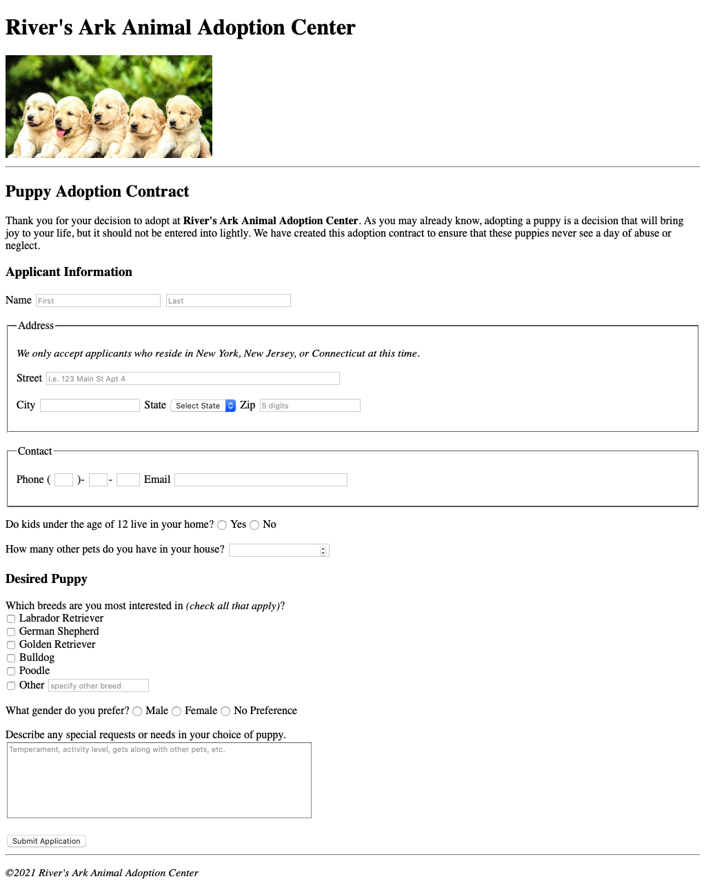
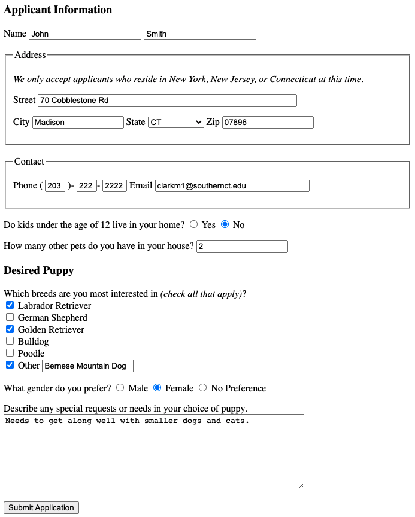
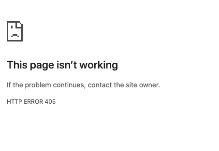
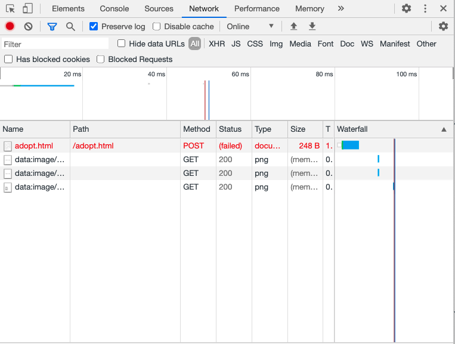
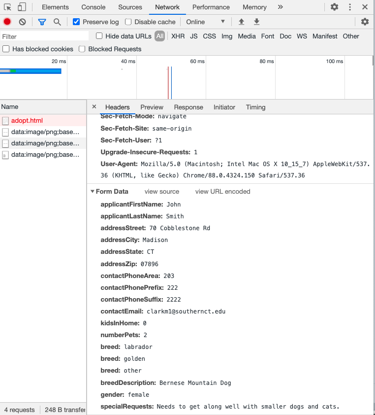

# Animal Adoption Contract Form Project
In this project, you will architect a form to accept puppy adoption applications for *River's Ark Animal Adoption Center*.

## Objectives
By the end of this exercise, you will be able to:
* Implement an HTML form.
* Understand and implement different types of form controls.
* Implement basic HTML form validation.
* Use structural tags to create a basic page layout.

## Instructions
*River's Ark Animal Adoption Center* has asked you to build a web page with an HTML form to accept puppy adoption applications for their upcoming adopt-a-thon event.

Your finished web page should mirror (as close as possible) the screenshot below.

Use *adopt.html* as a starging point for your page. The image seen in the screenshot is under `img/puppies.jpg`. 

Use the most appropriate form controls for each field. All fields are required accept for the *breed* information and *special circumstance* comments. Additionaly, make sure the following is validated on submission of the form:
* Zip - should be max 5 characters in length.
* Phone - the phone is divided into three fields ...
  * Area Code - max 3 characters in length
  * Prefix - max 3 characters in length
  * Suffix - max 4 characters in length
* Email - should be formatted as a valid email address
* Number of Pets in House - should be a valid number 0 or greater.
  
Your form should submit via the *POST* method to the same page (no action needed in form element to submit to the same page).

Below is an example of the form filled out with sample data.

When submitted, you will receive a page like the following (don't worry this is expected and acceptable for now) ...

In *Google Chrome*, under *Settings->Tools->Developer Tools, the above form submission will look as follows ...

The fields names submitted with your form should be the same as depicted in the image above. The values will be different depending on how you fill out your form. Note that the value for the field *kidsInHome* should be either a "0" or a "1" to represent no/yes respectively.

## Helpful Hints
Use some structural page elements to organize your page. For example, I used the `<header>` tag to contain my page heading and image, the `<main>` element to contain most everything else, and the `<footer>` element to house the copyright information.

Use `
` elements and ` ` elements to organize your fields. Also use the `<fieldset>` element along with `<legend>` for address and contact sections.

Don't forget to put validation where noted on your fields.

Don't forget to give your form controls ids and names and associate appropriate `<label>` elements to fields.

Finally, keep in mind that radio button and checkbox inputs will have the same name within a group to represent multiple selected values for that field/question. The values and ids for each will differ however.

## Submission
Before submitting your work, make sure *adopt.html* passes W3C validation. Commit and push any remaining changes to GitHub, and then submit your GitHub repository URL for the assignment in Blackboard.

